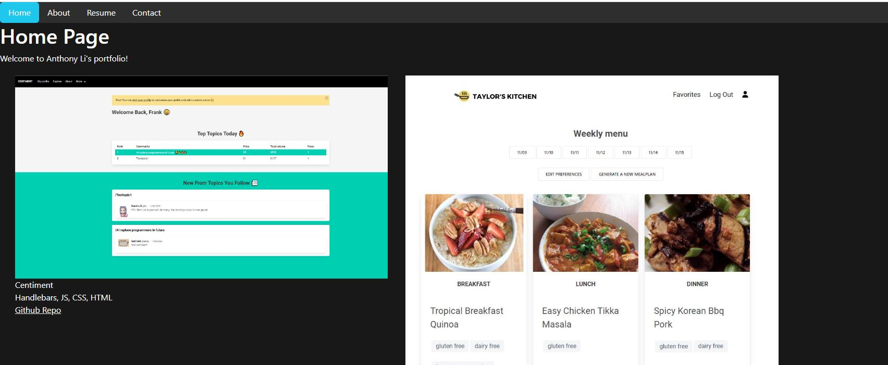
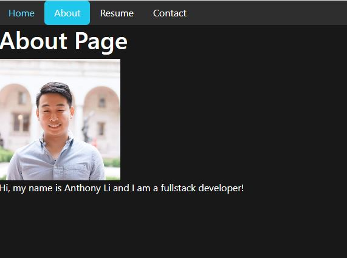
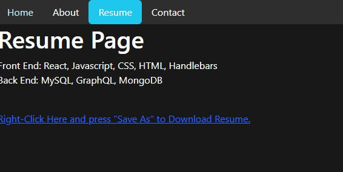
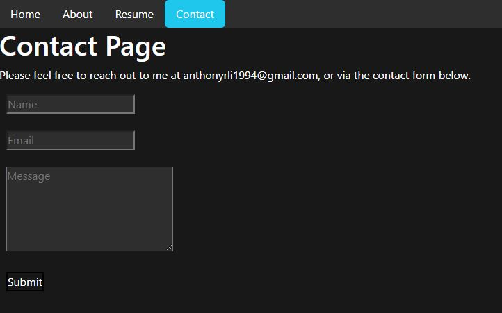

# React Portfolio -- Anthony

## Description
Anthony's portfolio made using React.

## Table of Contents
 - [React Portfolio -- Anthony](#react-portfolio----anthony)
 - [Description](#description)
 - [Installation Instructions](#installation-instructions)
 - [Usage Information](#usage-information)
 - [License](#license)
 - [Contribution Guidelines](#contribution-guidelines)
 - [Testing Instructions](#testing-instructions)
 - [Questions?](#questions)

## Questions?
- Github: https://github.com/lunchtimewhee 
- Email: anthonyrli1994@gmail.com

## Installation Instructions
Go to https://lunchtimewhee.github.io/React-Portfolio/#home

## Usage Information
1. Home page + Portfolio:

2. About me:

3. Resume: 

4. Contact Me:

## License

## Contribution Guidelines
Please reach out to Anthony Li.

## Testing Instructions
N/A

